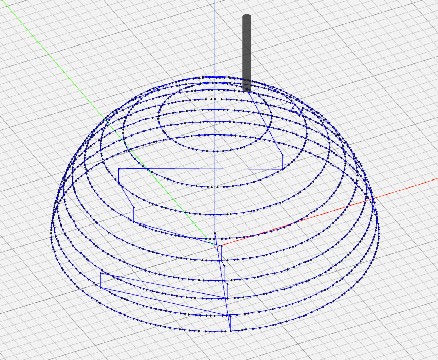

## WeekendSlicer

WeekendSlicer is a gcode generator aimed at 3D printing implicit surfaces. It is currently acting only as a proof of concept,
with no promise of generating correct paths; if you attempt to use it, please inspect the generated code for dangerous paths
prior to running it.

# References and Motivation

- [Manipulation of Implicit Functions](https://christopherolah.wordpress.com/2011/11/06/manipulation-of-implicit-functions-with-an-eye-on-cad/)
  - This is an excellent introduction to the subject of implicit functions.
- [Fidget](https://github.com/mkeeter/fidget)
  - Powerful library that WeekendSlicer relies on.
- [Interior SDFs](https://iquilezles.org/articles/interiordistance/)
  - Motivation behind the algorithm WeekendSlicer uses. Eventually it would be nice to generate "correct" SDFs from surface
    representations; perhaps going from surface to volume mesh, then volume mesh to "correct" SDF using these techniques.

# Algorithm Overview

WeekendSlicer uses a relatively simple approach to slice perimeters (which is currently all it is capable of):
- Read the surface representation in. For each layer do as follows.
  - For each perimeter do as follows.
    - Remap the z-axis values in the representation to the layer mean.
    - Add `extrusion_width * (perimeter_number + 1 / 2)` to this new representation.
    - Intersect this with a rectangular prism with a surface with `z = 0`.
    - Mesh this new representation and extract the edge paths. The details of this extraction are not that important, this
      and the last step would not be needed if fidget had an equivalent to `Mesh` for 2D surfaces.
    - Add the edge paths to a list.
- Convert the list of edge paths to gcode and write the file.

# Q&A

- Why is it called WeekendSlicer?
  - I initially wrote it over a long weekend.

- Is this useful?
  - Not yet! It might become more useful if I continue to work on it - especially once it can slice objects not natively
    represented by functions. It also needs many other features implemented to be considered close to complete: infill
    (medium difficulty), top and bottom surface detection (medium difficulty), algorithm simplification/offloading
    (difficult), seam alignment (easy enough). It has a long, long way to go before useful.

- How do I use this?
  - You really shouldn't yet, but if you insist on trying then the command should explain itself with the `-h` flag.
    Building the project is as easy as running `nix build` (if you use Nix).
